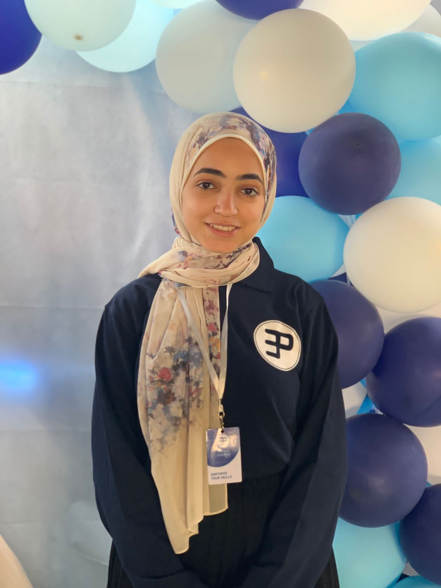

<div id="top"></div>
<!-- [![Contributors][contributors-shield]][contributors-url]

[![Issues][issues-shield]][issues-url]

[![LinkedIn][linkedin-shield]][linkedin-url] -->

<!-- PROJECT LOGO -->
<br />
<div align="center">
  <a href="https://github.com/github_username/repo_name">
    
  </a>

<h3 align="center">ICU Managing Website</h3>

  <p align="center">
    project_description
    <br />
    <a href="https://drive.google.com/file/d/1t9r6h8G3tB9nNJ5UeBeBm1CkLRuPEGaR/view?usp=sharing"><strong>Explore ER Model »</strong></a>
    <br />
    <br />
    <a href="https://drive.google.com/file/d/12-1FNUrpwY_I_W4lMm-7E9sLdMx11GyH/view">Demo Video</a>
    ·
    <a href="https://github.com/diaabadr/ICU-Managing-website/issues">Report Bug</a>
    ·
    <a href="https://github.com/diaabadr/ICU-Managing-website/issues">Request Feature</a>
  </p>
</div>

<!-- TABLE OF CONTENTS -->
<details>
  <summary>Table of Contents</summary>
  <ol>
    <li>
      <a href="#about-the-project">About The Project</a>
      <ul>
        <li><a href="#built-with">Built With</a></li>
      </ul>
    </li>
    <li>
      <a href="#getting-started">Getting Started</a>
      <ul>
        <li><a href="#installation">Installation</a></li>
      </ul>
    </li>
    <li><a href="#usage">Usage</a></li>
    <li><a href="#roadmap">Roadmap</a></li>
    <li><a href="#contributing">Contributing</a></li>
    <li><a href="#contact">Contact</a></li>
    <li><a href="#acknowledgments">Acknowledgments</a></li>
  </ol>
</details>

<!-- ABOUT THE PROJECT -->

## About The Project

[![Product Name Screen Shot][product-screenshot]](https://example.com)

<p align="right">(<a href="#top">back to top</a>)</p>

### Built With

> - Node JS
> - MongoDB
> - HTML
> - CSS
> - Handlebars

<p align="right">(<a href="#top">back to top</a>)</p>

<!-- GETTING STARTED -->

## Getting Started

This is an example the steps of how you sett up the project locally.
To get a local copy up and running follow these simple example steps.

### Installation

1. Install express js and npm. (https://www.youtube.com/watch?v=NrAU04kRvmM) video may help.
2. Install mongodb (https://www.youtube.com/watch?v=xGuS195qhcs&list=PLGhZWewM_75LQf3KvHo6HHSclmDyDazl7&index=28) video may help
3. Clone the repo
   ```sh
   git clone https://github.com/DiaaBadr/ICU-Managing-website.git
   ```
4. Open the project on vs Code.
5. Open the terminal
6. Install NPM packages
   ```sh
   npm install
   ```
7. Install nodemon
   ```sh
   npm install nodemon -g
   ```
8. Add Rooms
   ```sh
   node addingPatients/addingRooms
   ```
9. Add Rooms
   ```sh
   node addingStaff/add
   ```
   > **Note**
   > Now You have an Admin account
   >
   > - > - Email: maryammegahed@admin.com.
   > - > - Password: your first password will be considered the account password.
10. Run the project
    ```sh
    nodemon
    ```
11. Now open http://127.0.0.1:3000 on the browser.

<p align="right">(<a href="#top">back to top</a>)</p>

<!-- USAGE EXAMPLES -->

## Usage

Use this space to show useful examples of how a project can be used. Additional screenshots, code examples and demos work well in this space. You may also link to more resources.

_For more examples, please refer to the [Documentation](https://example.com)_

<p align="right">(<a href="#top">back to top</a>)</p>

<!-- ROADMAP -->

## Roadmap

- [ ] Feature 1
- [ ] Feature 2
- [ ] Feature 3
  - [ ] Nested Feature

See the [open issues](https://github.com/github_username/repo_name/issues) for a full list of proposed features (and known issues).

<p align="right">(<a href="#top">back to top</a>)</p>

<!-- CONTRIBUTING -->

## Contributors ✨

Thanks goes to these wonderful people.

<!-- ALL-CONTRIBUTORS-LIST:START - Do not remove or modify this section -->
<!-- prettier-ignore-start -->
<!-- markdownlint-disable -->
<table>
  <tr>
    <td align="center"><a href="https://www.linkedin.com/in/diaa-badr-b164661b9/"><br /><sub><b>Diaa Badr</b></sub></a><br /><a href="https://github.com/diaabadr/ICU-Managing-website/commits?author=diaabadr" title="Code">💻</a></td>
    <td align="center"><a href="https://www.linkedin.com/in/abdelrhmanyasser/"><br /><sub><b>Abdelrahman yasser</b></sub></a><br /><a href="https://github.com/diaabadr/ICU-Managing-website/commits?author=Abdelrhman012" title="Code" >💻</a></td>
     <td align="center"><a href="https://www.linkedin.com/in/maryam-megahed-129333203/"><br /><sub><b>Maryam Megahed</b></sub></a><br /><a href="https://github.com/diaabadr/ICU-Managing-website/commits?author=MaryamMegahed" title="Code">💻</a></td>

</table>
<table>
  <tr>
    <td align="center"><a href="https://www.linkedin.com/in/diaa-badr-b164661b9/"><br /><sub><b>Diaa Badr</b></sub></a><br /><a href="https://github.com/diaabadr/ICU-Managing-website/commits?author=diaabadr" title="Code">💻</a></td>
    <td align="center"><a href="https://www.linkedin.com/in/abdelrhmanyasser/"><br /><sub><b>Abdelrahman yasser</b></sub></a><br /><a href="https://github.com/diaabadr/ICU-Managing-website/commits?author=Abdelrhman012" title="Code" >💻</a></td>
     <td align="center"><a href="https://www.linkedin.com/in/maryam-megahed-129333203/"><br /><sub><b>Maryam Megahed</b></sub></a><br /><a href="https://github.com/diaabadr/ICU-Managing-website/commits?author=MaryamMegahed" title="Code">💻</a></td>

</table>

## Contributing

Any contributions you make are **greatly appreciated**.
If you have a suggestion that would make this better, please fork the repo and create a pull request. You can also simply open an issue with the tag "enhancement".
Don't forget to give the project a star! Thanks!

1. Fork the Project
2. Create your Feature Branch (`git checkout -b feature/AmazingFeature`)
3. Commit your Changes (`git commit -m 'Add some AmazingFeature'`)
4. Push to the Branch (`git push origin feature/AmazingFeature`)
5. Open a Pull Request

<p align="right">(<a href="#top">back to top</a>)</p>

<!-- LICENSE -->

<!-- CONTACT -->

## Contact

Your Name - [@twitter_handle](https://twitter.com/twitter_handle) - email@email_client.com

Project Link: [https://github.com/github_username/repo_name](https://github.com/github_username/repo_name)

<p align="right">(<a href="#top">back to top</a>)</p>

<!-- ACKNOWLEDGMENTS -->

<p align="right">(<a href="#top">back to top</a>)</p>

<!-- MARKDOWN LINKS & IMAGES -->
<!-- https://www.markdownguide.org/basic-syntax/#reference-style-links -->

[contributors-shield]: https://img.shields.io/github/contributors/DiaaBadr/ICU-Managing-Website.svg?style=for-the-badge
[contributors-url]: https://github.com/diaabadr/ICU-Managing-website/graphs/contributors
[issues-shield]: https://img.shields.io/github/issues/DiaaBadr/ICU-Managing-Website.svg?style=for-the-badge
[issues-url]: https://github.com/diaabadr/ICU-Managing-website/issues
[linkedin-shield]: https://img.shields.io/badge/-LinkedIn-black.svg?style=for-the-badge&logo=linkedin&colorB=555
[linkedin-url]: https://www.linkedin.com/in/diaa-badr-b164661b9/
[product-screenshot]: ./public/images/projectphoto.png
